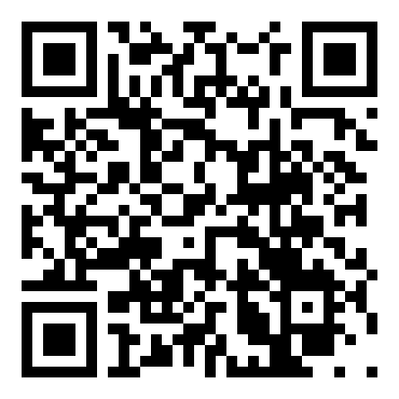

Writes a string to a QR Code and saves the code to a PNG or JPEG file.

Requires: `CMake` and `vcpkg` installed locally.

Uses [libpng](https://github.com/pnggroup/libpng), [libjpeg-turbo](https://github.com/libjpeg-turbo/libjpeg-turbo), and [QR-Code-generator](https://github.com/nayuki/QR-Code-generator/tree/master/cpp) as dependencies.

Configuring with CMake (i.e):

```bash
cmake -S . -B build -G Ninja -DCMAKE_TOOLCHAIN_FILE="$VCPKG_ROOT/scripts/buildsystems/vcpkg.cmake" -D CMAKE_BUILD_TYPE=RelWithDebInfo -D CMAKE_EXPORT_COMPILE_COMMANDS=ON

cmake --build build/
```

Usage (assuming the same build tree as the above):

```
Usage: ./build/qrgen -s <string> -o <filename> [options]
Options:
  -s, --string   The string to encode in the QR code (required).
  -o, --output   The output file name for the QR code (required).
  -j, --jpeg     Output a JPEG file instead of a PNG.
  -s --scale <scale>  Scale factor for the QR code (default: 12).
  -h, --help     Show this help message.
```

#### Generated example:


